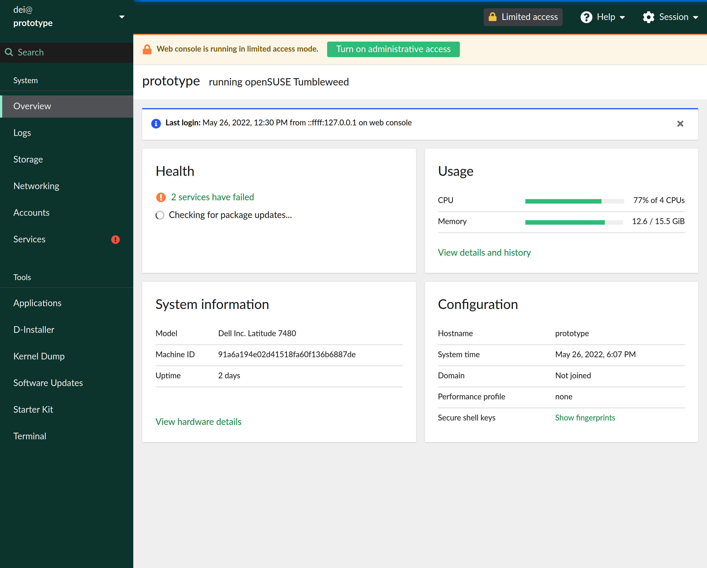

## cockpit-suse-theme

This repository holds needed files to buid a package1 for shipping a [Cockpit](https://cockpit-project.org/)'s _green-ish theme_ by following the workaround described at https://github.com/cockpit-project/cockpit/pull/17437.

  

## How it works

Based on [how Cockpit selects branding](https://github.com/cockpit-project/cockpit/blob/27cb665b5c135481f900dafac0c1b754ab91b5a0/doc/branding.md#how-cockpit-selects-branding), the package1 puts CSS overrides and resources in _/usr/share/cockpit/branding/default_. They will take effect only if Cockpit (actually, a Cockpit module) includes the _css-overrides.css_ as the last CSS file, which is the case for the [openSUSE patched versions](https://build.opensuse.org/project/show/systemsmanagement:cockpit).

In a nutshell, the mentioned file basically defines some [CSS Custom Properties](https://developer.mozilla.org/en-US/docs/Web/CSS/--*) used for redefining either, a CSS rule or the value of another [PatternFly](https://www.patternfly.org/)2 CSS Custom Property (aka [Global CSS Variable](https://www.patternfly.org/v4/developer-resources/global-css-variables)).

## Why a workaround

Because there isn't a better way yet. In fact, this is far from being ideal. See the explanation at https://github.com/cockpit-project/cockpit/issues/16359.

## Used resources

The colors, spacings, and typefaces were selected according to https://brand.suse.com and https://suse.eosdesignsystem.com.

See comments in [fonts.css](./fonts.css) file for fonts information and licenses. [google-webfonts-helpers](https://github.com/majodev/google-webfonts-helper) was used for downloading some of them.

## Previous experiments

For previous (and even _crazy_) experiments, see https://gist.github.com/dgdavid/ec2648c61f63f49a8aa8d9871d2b70f9 and https://gist.github.com/dgdavid/fa638109082e8a0038722ca917a195fd.

---

1 https://build.opensuse.org/package/show/home:dgdavid/cockpit-suse-theme

2 PatternFly is the design and component system used by Cockpit.
